# HCM Project

Surgical clinical history manager for Hospital Central de Maracay.

Monorepo with two apps:

| App | Path | Stack |
|-----|------|-------|
| Backend | `backend/` | NestJS 11 (Express), Prisma 5.22, PostgreSQL (Supabase), Bun 1.3.x |
| Frontend | `frontend/` | Next.js 16 (App Router, Turbopack), React 19, Tailwind CSS v4, shadcn/ui, Bun |

---

## Backend — NestJS + Hexagonal Architecture

### Architecture

Dependencies point **inward** — domain knows nothing about framework/DB/HTTP.

```mermaid
flowchart TD
    subgraph Infrastructure["infrastructure/ — NestJS, Prisma, Express"]
        Controller["Controllers\n(HTTP routes)"]
        Guard["Guards / Decorators\n(APP_GUARD global + @Public)"]
        Adapter["Adapters\n(Prisma repositories)"]
        Module["Modules\n(Wiring)"]
    end

    subgraph Application["application/ — Use Cases"]
        UseCase["LoginUseCase\nRegisterUseCase\n..."]
    end

    subgraph Domain["domain/ — Pure Business Logic"]
        Port["Ports\n(Interfaces)"]
        Entity["Entities / Value Objects"]
    end

    Controller --> UseCase
    Guard -- "canActivate (global)" --> Controller
    UseCase --> Port
    Port --> Adapter
    Adapter --> Module

    style Domain fill:#1a1a2e,stroke:#4a9eff,stroke-width:2px
    style Application fill:#16213e,stroke:#0f3460,stroke-width:2px
    style Infrastructure fill:#0f3460,stroke:#e94560,stroke-width:2px
```



### Layer Rules

| Layer | Depends on | Ignorant of |
|-------|-----------|-------------|
| **Domain** | Nothing | NestJS, Prisma, Express, Passport |
| **Application** | Domain ports | Prisma, Express, Passport |
| **Infrastructure** | Everything | — |

### Module Structure

```
backend/src/
├── auth/                 # Auth module (hexagonal)
│   ├── domain/ports/     # Interfaces
│   ├── application/      # Use cases
│   └── infrastructure/   # Guards, decorators, adapters, strategies
├── application/          # Shared use cases
├── domain/               # Shared domain models
└── infrastructure/       # Core NestJS setup, DB, config
```

### Database (Prisma schema)

Models: `patients`, `medical_staff`, `surgical_notes`, `surgical_team_members` (join table), `users` (auth).

### Setup

```bash
cd backend
bun install
```

### Run

```bash
bun run start:dev
```

### DB

```bash
bunx prisma migrate dev
bunx prisma generate
npx prisma db seed   # one demo user per role (see prisma/seed.ts)
```

### Auth

Custom JWT via Passport. `JwtAuthGuard` is registered as a **global** `APP_GUARD` in `AuthModule`: every route requires a Bearer token unless marked with the `@Public()` decorator. JWT lifetime: 8h (`JWT_SECRET` env).

Endpoints:

| Endpoint | Auth | Behavior |
|----------|------|----------|
| `POST /auth/register` | Public | email + password only. Role is assigned server-side (`enfermeria` by default); client-provided roles are **ignored** |
| `POST /auth/login` | Public | returns `{ user, token }` |
| `GET /auth/me` | JWT | returns the token's user; used by the frontend to validate sessions |

Roles MVP (`src/auth/domain/user.domain.ts`): `admin` \| `cirujano` \| `residente` \| `enfermeria`. Elevated roles are granted via seed or by an admin — never from the API payload.

---

## Frontend — Next.js 16

### Stack

- **Runtime:** Bun
- **Framework:** Next.js 16 (App Router, Turbopack)
- **UI:** shadcn/ui (base-nova style), Tailwind CSS v4, lucide-react
- **Animations:** tw-animate-css

### Setup

```bash
cd frontend
bun install
```

### Run

```bash
bun run dev
```

Open http://localhost:3000.

### Routes

| Route | Behavior |
|-------|----------|
| `/` | Redirects: token in `localStorage` → `/dashboard`, otherwise → `/login` |
| `/login` | Login form; authed users bounced to `/dashboard` |
| `/signup` | Signup form; role defaults to `enfermeria` server-side |
| `/dashboard` | Session validated against `GET /auth/me` (401 → clears session → `/login`). Shows email/role, logout |

Auth state: JWT in `localStorage` key `token` **and** in a `SameSite=Lax` cookie (8h max-age, matching the JWT lifetime). The edge middleware `src/proxy.ts` reads that cookie and protects `/dashboard` server-side.

### UI Text & Branding

Brand name and shared UI strings live in `frontend/src/lib/constants.ts` (`APP_NAME = "HOSPITAL CENTRAL DE MARACAY"`). UI text is Spanish.

### Large Monitor Scaling

Accessibility scale for ≥1920px screens: root `font-size` bumped to `112.5%` in `src/app/globals.css` — since all Tailwind utilities are rem-based, text, spacing, and component sizes scale proportionally. Custom `hd:` breakpoint (`--breakpoint-hd: 120rem`) available for per-element overrides.

### Notes

- Next.js 16 has breaking changes vs older versions. Read `node_modules/next/dist/docs/` before writing code (see `frontend/AGENTS.md`).
- Page transitions use `src/app/template.tsx` (fade-in on navigation).
