# HCM Backend — NestJS + Hexagonal Architecture

Surgical clinical history manager.

## Stack

- **Runtime:** Bun 1.3.x
- **Framework:** NestJS 11 (Express)
- **ORM:** Prisma 5.22 + PostgreSQL (Supabase)
- **Auth:** Passport + JWT (custom)

## Hexagonal Architecture (Ports & Adapters)

Dependencies point **inward** — domain knows nothing about framework/DB/HTTP.

```mermaid
flowchart TD
    subgraph Infrastructure["infrastructure/ — NestJS, Prisma, Express"]
        Controller["Controllers\n(HTTP routes)"]
        Guard["Guards / Decorators\n(Auth pipeline)"]
        Adapter["Adapters\n(Prisma repositories)"]
        Module["Modules\n(Wiring)"]
    end

    subgraph Application["application/ — Use Cases"]
        UseCase["LoginUseCase\nRegisterUseCase\n..."]
    end

    subgraph Domain["domain/ — Pure Business Logic"]
        Port["Ports\n(Interfaces)"]
        Entity["Entities / Value Objects"]
    end

    Controller --> UseCase
    Guard --> UseCase
    UseCase --> Port
    Port --> Adapter
    Adapter --> Module

    style Domain fill:#1a1a2e,stroke:#4a9eff,stroke-width:2px
    style Application fill:#16213e,stroke:#0f3460,stroke-width:2px
    style Infrastructure fill:#0f3460,stroke:#e94560,stroke-width:2px
```



### Layer Rules

| Layer | Depends on | Ignorant of |
|-------|-----------|-------------|
| **Domain** | Nothing | NestJS, Prisma, Express, Passport |
| **Application** | Domain ports | Prisma, Express, Passport |
| **Infrastructure** | Everything | — |

### Module Structure

```
src/
├── auth/                 # Auth module (hexagonal)
│   ├── domain/ports/     # Interfaces
│   ├── application/      # Use cases
│   └── infrastructure/   # Guards, decorators, adapters, strategies
├── application/          # Shared use cases
├── domain/               # Shared domain models
└── infrastructure/       # Core NestJS setup, DB, config
```

## Setup

```bash
bun install
```

## Run

```bash
bun run start:dev
```

## DB

```bash
bunx prisma migrate dev
bunx prisma generate
```

## Auth

Custom JWT via Passport. Protected routes use `@UseGuards(JwtAuthGuard)` + `@CurrentUser()` decorator.
