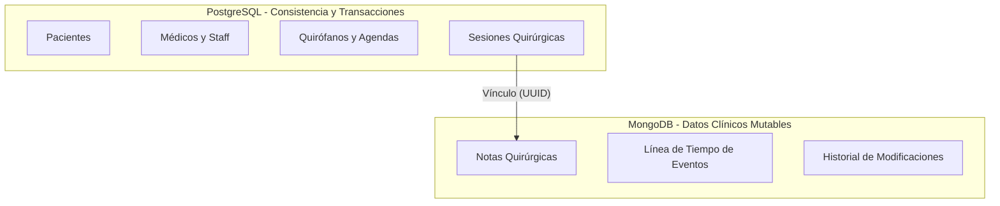

# Diseño de Arquitectura de Bases de Datos Híbrida

Este documento describe la estrategia de almacenamiento híbrido para la plataforma de notas quirúrgicas, combinando la consistencia y relaciones fuertes de **PostgreSQL** con la flexibilidad y escalabilidad de documentos de **MongoDB**.

---

## 🏛️ Estructura General de Responsabilidades



---

## 1. 🐘 PostgreSQL (El Núcleo Transaccional)

PostgreSQL actúa como el eje central de la aplicación. Maneja todos los datos estructurados que requieren integridad referencial estricta, unicidad de llaves y capacidades ACID para evitar colisiones de agenda.

### Tablas Propuestas (Esquema Conceptual)

#### `patients` (Pacientes)
Almacena la información demográfica clave del paciente.
*   `id` (UUID, PK)
*   `government_id` (VARCHAR, Unique) - Cédula o número de identidad.
*   `first_name` / `last_name` (VARCHAR)
*   `birth_date` (DATE)
*   `blood_type` (VARCHAR)
*   `created_at` / `updated_at` (TIMESTAMP)

#### `staff` (Personal Médico y de Soporte)
Médicos, enfermeros y anestesiólogos con sus respectivos roles y firmas.
*   `id` (UUID, PK)
*   `email` (VARCHAR, Unique)
*   `first_name` / `last_name` (VARCHAR)
*   `role` (ENUM: 'SURGEON', 'ANESTHESIOLOGIST', 'NURSE', 'ADMIN')
*   `digital_signature_hash` (TEXT) - Hash de la firma digital aprobada para validar notas.

#### `operating_rooms` (Quirófanos)
Salas de cirugía disponibles.
*   `id` (UUID, PK)
*   `name` (VARCHAR) - Ej: "Quirófano A - Cardiología".
*   `status` (ENUM: 'AVAILABLE', 'MAINTENANCE', 'INACTIVE')

#### `surgical_sessions` (Agenda Quirúrgica)
La tabla transaccional crítica. Utiliza restricciones exclusivas para asegurar que un quirófano o cirujano no sea agendado dos veces en el mismo bloque horario.
*   `id` (UUID, PK)
*   `patient_id` (UUID, FK -> `patients.id`)
*   `lead_surgeon_id` (UUID, FK -> `staff.id`)
*   `anesthesiologist_id` (UUID, FK -> `staff.id`)
*   `operating_room_id` (UUID, FK -> `operating_rooms.id`)
*   `scheduled_start` (TIMESTAMP)
*   `scheduled_end` (TIMESTAMP)
*   `status` (ENUM: 'SCHEDULED', 'IN_PROGRESS', 'COMPLETED', 'CANCELLED')
*   `surgical_note_id` (VARCHAR) - **ID de referencia (UUID) al documento en MongoDB**.

---

## 2. 🍃 MongoDB (La Flexibilidad Clínica)

MongoDB se encarga de guardar las notas quirúrgicas. Las cirugías varían de acuerdo a la especialidad médica, por lo cual forzar un esquema relacional estricto provocaría problemas de performance y migraciones constantes.

### Colección: `surgical_notes` (Notas Quirúrgicas)

```json
{
  "_id": "507f1f77bcf86cd799439011", 
  "session_id": "session-uuid-from-postgres",
  "status": "DRAFT", // DRAFT, PENDING_SIGNATURE, SIGNED
  "version": 3,
  "specialty": "CARDIOLOGY",
  "pre_operative_diagnosis": "CIE10-I25.1",
  "post_operative_diagnosis": "CIE10-I25.2",
  "procedures_performed": ["CUPS-36.11", "CUPS-36.12"],
  "details": {
    "approach": "Esternotomía media",
    "findings": "Estenosis severa de la arteria descendente anterior...",
    "complications": "Ninguna",
    "blood_loss_ml": 250
  },
  "materials_used": [
    {
      "item_id": "suture-prolene-3-0",
      "name": "Prolene 3-0",
      "quantity": 2,
      "lot_number": "LOT12345"
    }
  ],
  "timeline": [
    { "event": "PATIENT_ENTERED", "timestamp": "2026-07-26T08:00:00Z" },
    { "event": "ANESTHESIA_INDUCED", "timestamp": "2026-07-26T08:15:00Z" },
    { "event": "SURGERY_STARTED", "timestamp": "2026-07-26T08:30:00Z" },
    { "event": "SURGERY_ENDED", "timestamp": "2026-07-26T11:45:00Z" }
  ],
  "signatures": []
}
```

### Ventajas de este Enfoque
1.  **Dinamismo según Especialidad**: El campo `details` puede cambiar su estructura por completo dependiendo del valor de `specialty` sin alterar otras notas.
2.  **Inmutabilidad Quirúrgica (HIPAA / Auditoría)**: Una vez que el estado de la nota en MongoDB cambia a `SIGNED`, el backend rechaza cualquier petición de actualización (`PUT`/`PATCH`). Los cambios posteriores deben guardarse como adendas separadas.
3.  **Auditoría**: Se pueden guardar documentos históricos completos en una colección `surgical_notes_history` para auditorías legales sin penalizar el rendimiento del sistema principal.
